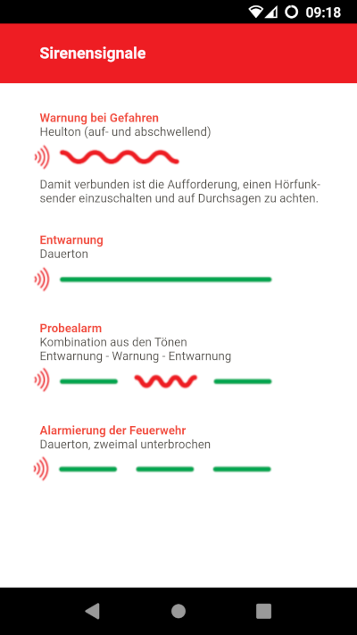

# Sirenensignale

Eine einfache Android-App, die die aktuellen Sirenensignale in Deutschland erklärt.

## Hinweise

Die App stellt wirklich nur die Sirenensignale in Symbole dar. Es ist kein Sound hinterlegt. Es gibt keine weiteren Fenster. Sie soll lediglich dazu dienen, schnell auf dem Handy nachschauen zu können was ein Sirensignal bedeutet, sobald eins ertönt.

Inspiriert wurde die App durch einen Flyer vom Ministerium des Innern
des Landes Nordrhein-Westfalen zum Warntag 2018.

## Download

Eine selbstsignierte APK steht hier zum Download bereit:
[http://www.arachnon.de/sirenensignale/de.arachnon.sirenensignale.apk](http://www.arachnon.de/sirenensignale/de.arachnon.sirenensignale.apk)

## Code

Es handelt sich um eine Cordova App, die keinerlei Rechte auf dem Gerät erfordert. Sie ist mit der Mindestanforderung "SDK 22" und der "Ziel SDK 30" versehen. Somit zielt die App auf Android 11, lässt sich aber auch noch auf Android 5.1 installieren.